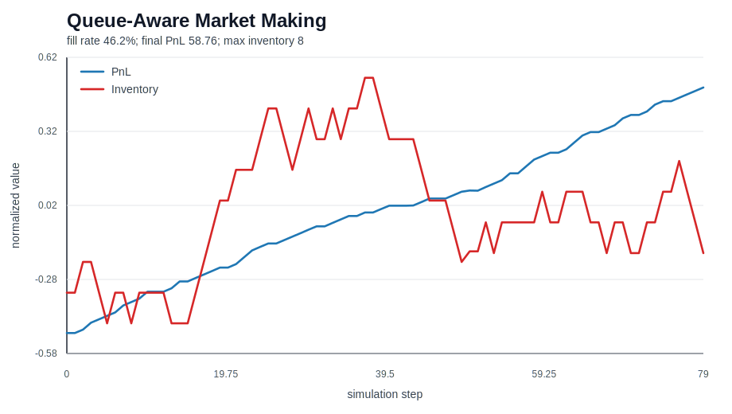
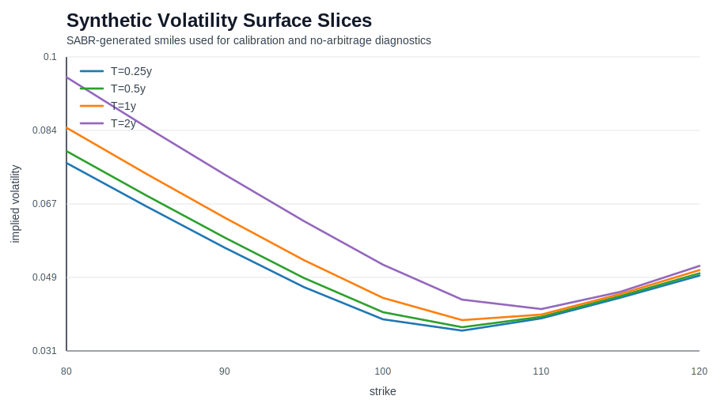
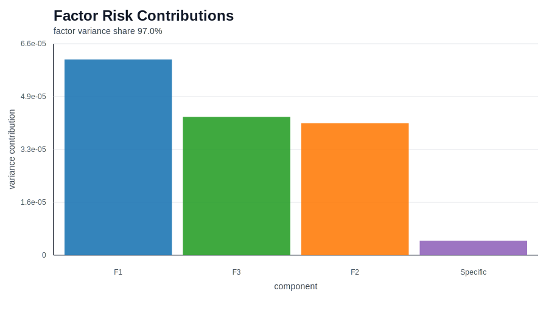

# Quant Systems Lab

[](https://github.com/Fink692/quant-systems-lab/actions/workflows/ci.yml)
[](https://github.com/Fink692/quant-systems-lab/actions/workflows/reproduce-market-making.yml)

Quant Systems Lab is a Python quantitative-research platform centered on a real-data, queue-aware market-making study. It also contains tested implementations of stochastic-volatility options, constrained RL trading, factor risk, robust portfolio optimization, rough volatility, statistical arbitrage, credit risk, volatility-surface arbitrage, and systemic-risk networks.

The flagship pipeline ingests real NASDAQ-derived order-book messages, validates provenance, reconstructs and reconciles the book, calibrates market descriptors, and compares five policies on a chronological held-out interval with explicit queue position, latency, fees, inventory limits, adverse selection, liquidation, and independent PnL accounting.

## Why This Project Matters

- Uses immutable experiment configurations, dataset hashes, append-only run records, chronological splits, and accounting invariants.
- Preserves negative results: all five policies lose money on the public sample, and the repository explicitly avoids presenting one session as persistent alpha.
- Includes deterministic synthetic workflows for model correctness plus real order-book, S&P 500, and leveraged-ETF research paths.
- Ships with 211 tests, 88.66% measured coverage with an 85% CI floor, Python 3.11-3.13 CI, Ruff, Black, MyPy, dependency auditing, pre-commit, documentation builds, and benchmark regression checks.

## Flagship Result: Real-Data Market Making

The reproducible public-sample study processes 301,587 synchronized AAPL messages and Level-5 book states. Reconstruction exactly matches 89.17% of synchronized states; the remaining Level-5 boundary mismatches are counted and reseeded rather than hidden. Validation selects the queue assumption before the held-out comparison.

| Policy | Test net PnL | Max absolute inventory | Max drawdown |
| --- | ---: | ---: | ---: |
| Fixed spread | -130.63 | 99 | 142.23 |
| Avellaneda-Stoikov | -98.88 | 91 | 117.22 |
| Queue aware | -67.80 | 76 | 90.81 |
| Toxicity aware | -47.34 | 52 | 71.01 |
| Latency aware | -47.34 | 52 | 71.01 |

This is a pipeline-validation result, not a profitability claim. The next empirical gate is licensed multi-session L2/L3 data with true receive timestamps.

```bash
python -m pip install -e ".[dev,research]"
make fetch-order-book-data
make reproduce-market-making-sample
make market-making-notebook
make market-making-paper
make market-making-video
```

Artifacts:

- [Research paper PDF](output/pdf/queue_aware_market_making_sample_paper.pdf)
- [One-page tear sheet](output/pdf/queue_aware_market_making_tear_sheet.pdf)
- [Narrated research demo](output/video/queue_aware_market_making_demo.mp4)
- [Executed start-here notebook](notebooks/start_here_market_making.ipynb)
- [Generated study](reports/market_making_sample/study.md)
- [Data-quality report](reports/market_making_sample/data_quality.md)
- [Architecture](docs/FLAGSHIP_ARCHITECTURE.md)
- [Assumptions and limitations](docs/ASSUMPTIONS_AND_LIMITATIONS.md)
- [Model cards](docs/MODEL_CARDS.md)
- [Roadmap completion audit](docs/ROADMAP_COMPLETION_AUDIT.md)
- [Five-minute demo runbook](docs/FIVE_MINUTE_DEMO.md)

Launch the interactive dashboard after installing `.[dashboard]`:

```bash
make market-making-dashboard
```

## System Coverage

| Area | Implemented capabilities |
| --- | --- |
| Stochastic volatility options | Black-Scholes, Heston Fourier pricing/calibration, Bates jumps, SABR smile/surface calibration, SVI/SSVI, Greeks, density extraction, PDE/Monte Carlo baselines, variance reduction, delta hedging |
| Volatility surface arbitrage | Calendar, butterfly, vertical and price-bound checks, Dupire local volatility, interpolation-stability diagnostics, constrained surface repair |
| Market making | Price-level limit order book, Avellaneda-Stoikov quotes, queue-aware book-level agent simulation, Hawkes order flow, latency replay, fill calibration, toxicity metrics, PnL attribution |
| RL trading | Trading environments, tabular Q-learning, neural Q-learning with replay, softmax policy gradient, Lagrangian constrained policy gradient, walk-forward evaluation, drawdown/leverage controls |
| Factor risk | OLS factor model, rolling out-of-sample validation, style/sector/macro/cross-sectional factors, PCA factors, factor-mimicking portfolios, covariance shrinkage, VaR/CVaR backtesting |
| Portfolio optimization | Minimum variance, mean-variance, risk parity, risk budgeting, empirical CVaR, CDaR, Black-Litterman, Bayesian shrinkage, robust and ellipsoidal robust optimization, turnover constraints, stress testing |
| Rough volatility | Rough Bergomi path simulation/pricing, variogram Hurst estimation, ATM skew power-law calibration, option-chain proxy calibration |
| Statistical arbitrage | Engle-Granger and Johansen cointegration, OU diagnostics, Kalman dynamic hedge ratios, pair/basket backtests, cointegration networks, ranked pair selection |
| Credit risk | Merton/KMV structural default, hazard bootstrapping, Cox/logistic/CIR intensity models, risky bonds/CDS, migration matrices, Gaussian copula portfolio losses, tranches, CVA/wrong-way risk |
| Systemic risk | Contagion propagation, DebtRank, Eisenberg-Noe clearing, capital adequacy, centrality, fire-sale feedback, liquidity spirals, scenario and Monte Carlo stress tests |

## Architecture

```text
src/quantlab/
  options/          Derivatives pricing, calibration, surfaces, Greeks, hedging
  market_making/    Limit order book, execution, queue, latency, Hawkes flow
  rl/               Trading environments and risk-constrained learning agents
  risk/             Factor models, covariance, attribution, VaR validation
  portfolio/        Optimizers, robust allocation, stress and drawdown analytics
  rough_vol/        Rough Bergomi simulation, pricing, and calibration
  stat_arb/         Cointegration, Kalman hedge ratios, basket/pair backtests
  credit/           Structural/reduced-form credit risk, CVA, portfolios
  systemic/         Network contagion, clearing, capital, liquidity stress
  data/             Synthetic datasets and schema-checked loaders
  market_data/      Provider adapters, manifests, reconstruction, reconciliation
  workflows/        End-to-end deterministic demo suite
  reporting/        Markdown report generation
  research/         Frozen configs, registries, calibration, chronological studies
```

Tests live in `tests/` and are intentionally broad: most modules are exercised both directly and through workflow-level smoke tests.

## Quick Start

```powershell
python -m pip install -e ".[dev,research]"
pytest
quantlab demo-suite --seed 7
```

If editable install is not desired, the tests also add `src` to `PYTHONPATH` through `tests/conftest.py`.

## CLI Examples

```powershell
quantlab price-option --spot 100 --strike 100 --maturity 1 --rate 0.03 --volatility 0.2
quantlab implied-vol --price 9.4134 --spot 100 --strike 100 --maturity 1 --rate 0.03
quantlab market-maker-demo --steps 100 --seed 7
quantlab demo-suite --seed 7
quantlab surface-demo
quantlab risk-demo --seed 7
quantlab portfolio-demo --seed 7
quantlab data-demo --seed 7
quantlab demo-report --seed 7 --output examples/demo_report_seed7.md
```

## Valuation-Regime Research Study

The repo now includes a reproducible S&P 500 valuation-regime allocation study using the DataHub/Shiller monthly dataset.

```powershell
python examples/fetch_shiller_sp500_data.py --output data/real/shiller_sp500_monthly.csv
python examples/run_valuation_regime_study.py --data data/real/shiller_sp500_monthly.csv --config config/valuation_regime.json --output reports/valuation_regime_study.md
```

Artifacts:

- [Research memo](docs/RESEARCH_MEMO_VALUATION_REGIME.md)
- [Generated tear sheet](reports/valuation_regime_study.md)
- [Data source notes](docs/DATA_SOURCES.md)
- [Hiring readiness audit](docs/HIRING_READINESS_AUDIT.md)

The study uses train/validation/test walk-forward folds through September 2023, lagged valuation signals, transaction costs, slippage, volatility targeting, drawdown controls, block-bootstrap confidence intervals, deflated Sharpe, a fold-based probability-of-overfitting diagnostic, parameter-stability tables, a bond-sleeve scenario, and 60/40, volatility-targeted, volatility-matched, and beta-matched baselines. It is intentionally honest: the strategy reduces equity risk, but does not beat buy-and-hold CAGR or the simpler risk-matched baselines on Sharpe and drawdown.

## Leveraged Trend Holdout Study

The second real-data study tests a fixed TQQQ trend and volatility-targeting family. Parameters are selected on 2017-2020 data and evaluated once on a January 2021 through July 10, 2026 holdout.

```powershell
python examples/fetch_leveraged_etf_data.py --output data/real/leveraged_etf_adjusted.csv --metadata data/real/leveraged_etf_adjusted.metadata.json
python examples/run_leveraged_trend_study.py --data data/real/leveraged_etf_adjusted.csv --config config/leveraged_trend.json --output reports/leveraged_trend_study.md
```

The selected 200-day trend model produced a **23.29% historical holdout CAGR** after 10 bps turnover costs, with 27.62% annualized volatility and a 24.22% maximum drawdown. Forty of 48 prespecified parameter combinations exceeded 20% CAGR, but a block bootstrap estimated only a 56.65% probability of clearing that threshold. This is historical evidence, not a forecast or guaranteed annual return.

The required long-history falsification does **not** clear the same hurdle. A transparent 3x reconstruction from real QQQ adjusted returns and lagged FRED financing produces only **15.13% CAGR from 2000 through July 2026**, including 3.96% during 2000-2009. It reconciles to actual TQQQ at 0.99894 daily-return correlation but is still optimistic by 2.38% annually. The 20% objective therefore remains unproven outside the recent regime.

A defensive QQQ/GLD/TLT momentum grid was also tested with adjusted next-open execution. The development-selected weekly model earns only **8.06% evaluation CAGR** and is rejected. A monthly-only row reaches 20.73% over the full 2005–2026 sample, but frequency sensitivity was discovered after evaluation inspection, so it is disclosed as an exploratory lead rather than promoted as validated alpha.

## Forward Paper Ledger

Historical parameters are now frozen as `leveraged-trend-v1`. The append-only ledger records each next-session target before its return is known, hashes the exact source snapshot and configuration, chains records cryptographically, and rejects duplicate sessions or Yahoo/Nasdaq close discrepancies above 5 bps.

The genesis record was created after the July 13, 2026 close for the July 14 session: **33.9413% TQQQ and 66.0587% BIL**. This is the beginning of prospective evidence, not a profitability claim.

An execution-timing audit now applies each completed-close signal at the next open. The old weight earns the overnight move, the new weight earns the intraday move, and 10 bps times turnover is charged at the open. On the 2021 through July 13, 2026 holdout this convention produced **25.53% CAGR**, **0.96 Sharpe**, and **23.06% maximum drawdown**. The separate outcome scorer will append the July 14 result only after that session has completed.

- [Paper-trading protocol](docs/PAPER_TRADING_PROTOCOL.md)
- [Decision ledger](paper/leveraged_trend_decisions.jsonl)
- [Genesis input metadata](data/paper/leveraged_trend_inputs_2026-07-13.metadata.json)
- [Execution-timing audit](reports/leveraged_trend_execution_timing.md)
- [Adjusted OHLC metadata](data/paper/execution_timing_ohlc_2026-07-13.metadata.json)

Artifacts:

- [Leveraged trend research memo](docs/RESEARCH_MEMO_LEVERAGED_TREND.md)
- [Generated leveraged trend tear sheet](reports/leveraged_trend_study.md)
- [Price snapshot metadata](data/real/leveraged_etf_adjusted.metadata.json)
- [Long-history falsification memo](docs/RESEARCH_MEMO_LEVERAGED_TREND_LONG_HISTORY.md)
- [Generated long-history stress report](reports/leveraged_trend_long_history.md)
- [Defensive-momentum research memo](docs/RESEARCH_MEMO_DEFENSIVE_MOMENTUM.md)
- [Generated defensive-momentum report](reports/defensive_momentum_study.md)

## Verification

Current local verification:

```text
211 passed; 88.66% coverage
```

GitHub Actions runs formatting, linting, scoped static typing, strict documentation builds, dependency auditing, coverage, and the complete test suite across Python 3.11, 3.12, and 3.13.

## Example Output

- [Demo report, seed 7](examples/demo_report_seed7.md)
- [Market-making case study](docs/CASE_STUDY_MARKET_MAKING.md)
- [Flagship real-data market-making research plan](docs/FLAGSHIP_MARKET_MAKING_RESEARCH_PLAN.md)
- [Real-data valuation-regime study](docs/RESEARCH_MEMO_VALUATION_REGIME.md)
- [Valuation-regime tear sheet](reports/valuation_regime_study.md)
- [Leveraged trend holdout study](docs/RESEARCH_MEMO_LEVERAGED_TREND.md)
- [Leveraged trend tear sheet](reports/leveraged_trend_study.md)
- [Leveraged trend long-history falsification](docs/RESEARCH_MEMO_LEVERAGED_TREND_LONG_HISTORY.md)
- [Frozen paper-trading protocol](docs/PAPER_TRADING_PROTOCOL.md)
- [Real-data-compatible price panel workflow](docs/REAL_DATA_WORKFLOW.md)
- [Hiring readiness audit](docs/HIRING_READINESS_AUDIT.md)
- [Interview prep notes](docs/INTERVIEW_PREP.md)
- [Resume project brief](docs/PROJECT_BRIEF.md)
- [GitHub profile checklist](docs/PROFILE_CHECKLIST.md)

## Visual Artifacts

These charts are generated from the package with `python examples/generate_resume_artifacts.py --seed 7`.







## Resume Summary

Built a 211-test Python quant-finance research platform centered on a real-data queue-aware market-making study with event-level ingestion, reconstruction, chronological evaluation, latency/queue/fee sensitivity, immutable experiment provenance, independent PnL reconciliation, and five-policy comparison; supported by three real-data allocation studies, prospective hash-chained paper decisions and outcomes, and derivatives, portfolio, risk, credit, statistical-arbitrage, RL, and systemic-risk modules.

## Limitations and Next Extensions

The included public order-book sample covers one session and five visible levels, has no distinct receive timestamp, and cannot establish persistent profitability. The leveraged trend holdout spans only 5.5 years and cannot establish a future 20% return. Stronger empirical claims require licensed multi-session data, later untouched periods, forward paper trading, execution connectivity, operational controls, and independent model validation.

## License

MIT License. See [LICENSE](LICENSE).
