# Flagship Market-Making Architecture

```mermaid
flowchart LR
    A["Licensed raw L2/L3 files"] --> B["Provider adapter"]
    B --> C["Canonical UTC event contract"]
    B --> D["Synchronized provider snapshots"]
    C --> E["SHA-256 manifest and provenance"]
    C --> F["Event-by-event reconstruction"]
    D --> F
    F --> G["Reconciliation and quarantine"]
    G --> H["Chronological train period"]
    G --> I["Chronological validation period"]
    G --> J["Untouched test period"]
    H --> K["Arrival, cancellation, fill, spread, toxicity calibration"]
    I --> L["Frozen parameter selection"]
    K --> L
    L --> M["Shared latency and queue replay engine"]
    J --> M
    M --> N["Fixed spread"]
    M --> O["Avellaneda-Stoikov"]
    M --> P["Queue aware"]
    M --> Q["Toxicity aware"]
    M --> R["Latency aware"]
    N --> S["Independent cash and inventory ledger"]
    O --> S
    P --> S
    Q --> S
    R --> S
    S --> T["Fees, adverse selection, inventory risk, tail loss, PnL attribution"]
    T --> U["Block-bootstrap comparisons and sensitivity grid"]
    U --> V["Immutable experiment registry"]
    V --> W["Paper, tear sheet, notebook, and dashboard"]
```

## Trust boundaries

- Raw provider data is read-only, hashed, ignored by Git, and never embedded in distributable artifacts.
- Provider-specific semantics end at the canonical event and snapshot contracts.
- Training, validation, embargo, and test periods are physically separate frames.
- Every policy uses the same event stream, execution model, fees, limits, and liquidation convention.
- The cash ledger is recomputed independently from fill records; a non-zero accounting error invalidates the result.
- Public LOBSTER sample output is labelled pipeline validation. A flagship empirical claim requires licensed multi-session data.
